# Charon Forge

**Build No Man's Sky bases and corvettes in Blender, with the game's real models.**

Charon Forge is a Blender extension for designing No Man's Sky bases and corvettes. Every part you place is the game's own high-resolution model, textured and coloured the way it looks in game. When you're done, the build goes straight back into your save or out as a file to share.

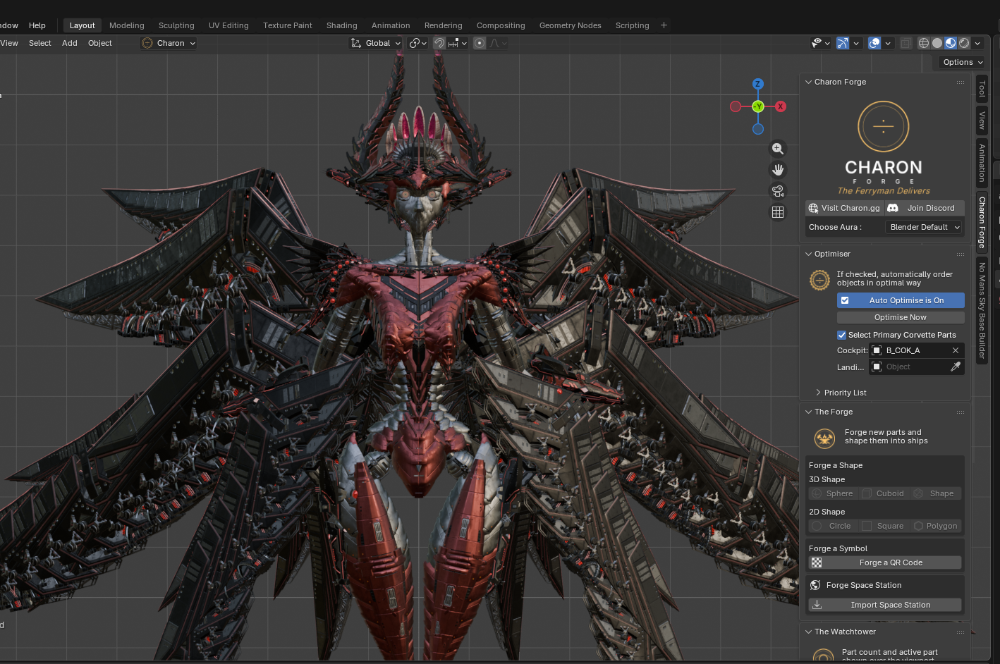

---

## Contents

- [Features at a glance](#features-at-a-glance)
- [Requirements](#requirements)
- [Installation](#installation)
- [The Charon menu](#the-charon-menu)
- [The Asset Browser](#the-asset-browser)
- [The Charon Forge sidebar](#the-charon-forge-sidebar)
  - [Header: links and themes](#header-links-and-themes)
  - [Optimiser](#optimiser)
  - [Crossing: import and export](#crossing-import-and-export)
  - [The Watchtower](#the-watchtower)
  - [The Forge](#the-forge)
  - [Helmsman](#helmsman)
- [Working with the No Man's Sky Base Builder addon](#working-with-the-no-mans-sky-base-builder-addon)
- [Credits and support](#credits-and-support)

---

## Features at a glance

- **High-resolution parts:** the game's own models and textures for every part, not simplified stand-ins.
- **In-game colours:** parts use the game's real palettes and finishes, and groups keep their colour.
- **Asset Browser:** every buildable part, by category, with thumbnails, search, favourites, recents and variants.
- **Optimiser:** orders your parts so the ones that matter most are saved first.
- **Crossing:** import and export `.nmsship`, `.json` and `.txt` files, or through the clipboard.
- **The Watchtower:** part count, base type and the selected part shown over the viewport.
- **The Forge:** spheres, cuboids, circles, polygons and more, made from copies of any part. QR codes. Full space stations to build inside.
- **Helmsman:** review a batch of ships and write the approved ones into your save's ship slots.
- **Correct mirroring:** mirrored parts face the right way in Blender and in game.

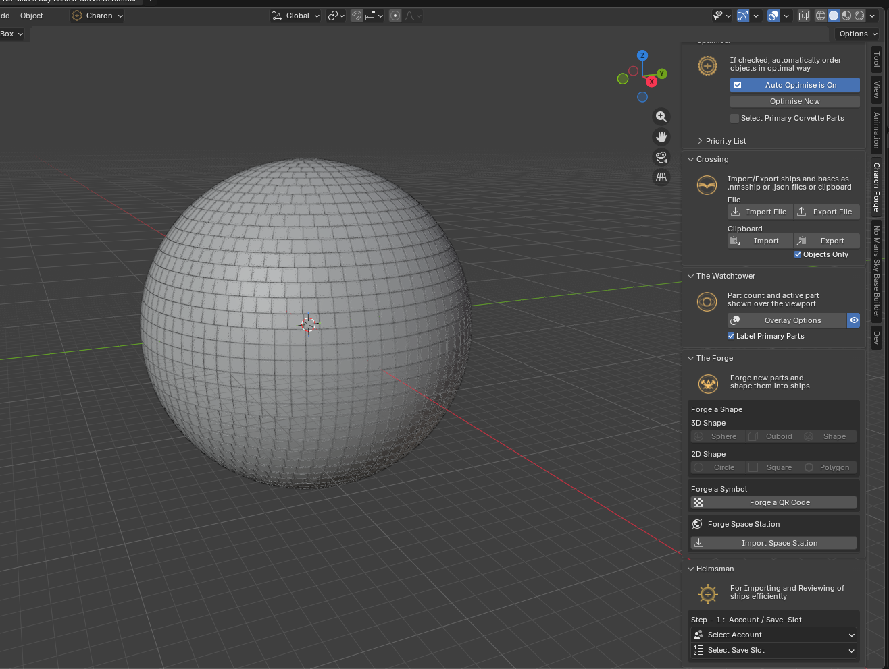

---

## Requirements

- [Blender](https://www.blender.org) **4.5 or newer**
- Optional: the **No Man's Sky Base Builder** addon, **version 7.0.0 only**. Charon Forge works on its own; the Base Builder adds its own building tools, which Charon Forge then powers with high-resolution parts. See [Working with the No Man's Sky Base Builder addon](#working-with-the-no-mans-sky-base-builder-addon).

## Installation

First, download the latest `charon_forge-*.zip` from the [Releases page](https://github.com/xX-Charon-Xx/charon_forge/releases). Don't unzip it. Blender installs the `.zip` as it is.

**Option 1: drag and drop**

1. Open Blender.
2. Drag the `.zip` file from your file browser and drop it anywhere onto the Blender window.
3. Click **Install** in the popup that appears.

**Option 2: from Preferences**

1. In Blender, open **Edit > Preferences** and go to **Get Extensions**.
2. Click the dropdown arrow in the top right corner and choose **Install from Disk...**
3. Pick the `charon_forge-*.zip` file and click **Install from Disk**.

Either way, Charon Forge is enabled straight away. To update later, install the new `.zip` the same way; it replaces the old version.

Charon Forge then appears as a **Charon** menu in the 3D viewport's header, and a **Charon Forge** tab in the sidebar (press `N` in the viewport).

**Optional: the No Man's Sky Base Builder addon.** To also use the Base Builder's own tools (see [Working with the No Man's Sky Base Builder addon](#working-with-the-no-mans-sky-base-builder-addon)), download it from its [7.0.0 release](https://github.com/kuma-the-wizard/nms-base-builder/releases/tag/7.0.0) and install its `.zip` the same way.

> **Note:** only **version 7.0.0** of the Base Builder works with Charon Forge. Other versions, older or newer, aren't supported.

---

## The Charon menu

The **Charon** menu in the 3D viewport's header is the quick way in.

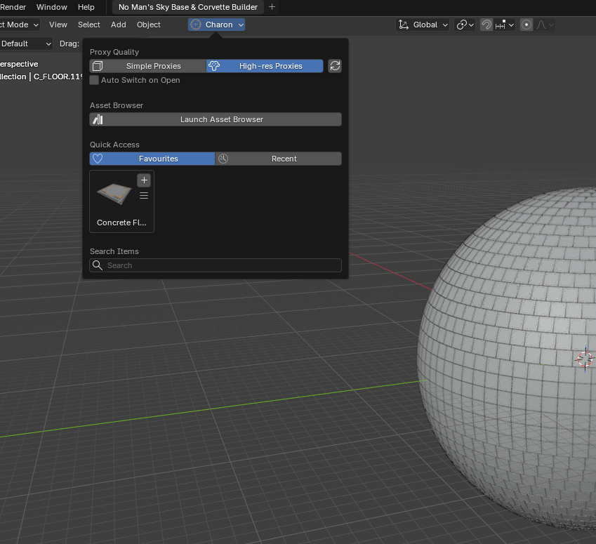

- **Proxy Quality:** switch the whole scene between **High-res Proxies** (the game's real models) and **Simple Proxies** (lighter models, for very large builds). The refresh button next to them, **Fix Scene**, reloads every part and texture from the current install. It fixes missing textures and picks up updated models.
  - Switching to Simple Proxies asks what to do with any Forge shapes in the scene first. Simple Proxies can't export shapes, so Charon offers to split each one into individual parts, putting each shape's parts in their own collection.
- **Auto Switch on Open:** when opening a file, switch it to your preferred quality automatically.
- **Launch Asset Browser:** opens the Asset Browser in its own window.
- **Quick Access:** your **Favourites** and **Recent** parts, ready to place.
- **Search Items:** type to search every part. The best eight matches appear right under the search box.

---

## The Asset Browser

Every buildable part in the game, in one window.

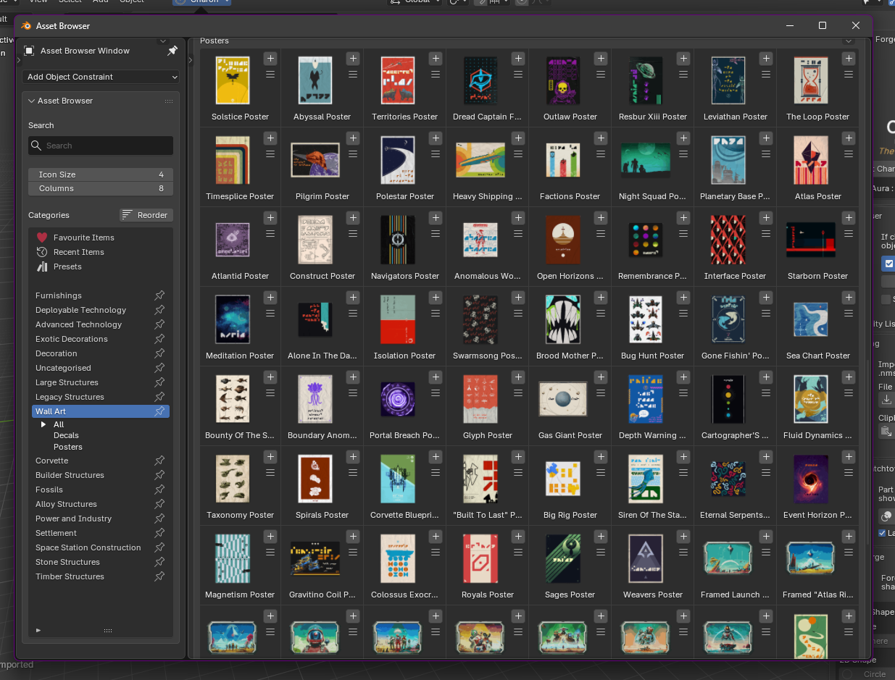

- **Categories:** browse by category and sub-category, the way the game groups them.
  - Pin categories to keep them at the top, and reorder them with **Reorder**.
- **Search:** type to filter by name or part id.
- **Favourites, Recent Items and Presets** have their own lists.
- **Placing parts:** click a part, or its **+** button, to place it. New parts are placed where the selected part is, so you can build outwards from what you have.
- **Options (the ☰ button):**
  - add or remove the part from your favourites;
  - **Replace Selected Objects**, which swaps everything selected for this part;
  - **Variants:** every form of the part, the main one first, each with its thumbnail. For example, the N / S / E / W and mirrored versions of a corvette hull piece.
- **Icon Size and Columns** change the layout of the grid.

Placing the first cockpit or landing bay in a scene marks it as the ship's primary one automatically (see [Optimiser](#optimiser)).

---

## The Charon Forge sidebar

Open the sidebar with `N` in the 3D viewport and choose the **Charon Forge** tab.

### Header: links and themes

At the top of the tab:
- **Visit Charon.gg** and **Join Discord**.
- **Choose Aura:** switch Blender's whole interface to one of Charon's themes, such as Charon, Purple Dream, or the Jedi and Sith interfaces. Your choice is kept between sessions.

### Optimiser

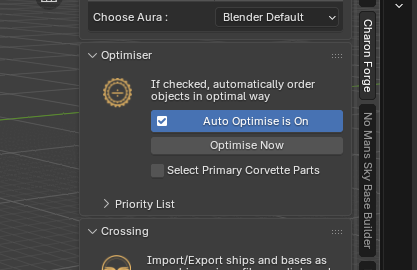

The order parts are saved in matters to the game. The Optimiser puts the parts that matter most first.

- **Auto Optimise:** reorders the parts every time the build is saved or exported.
- **Optimise Now:** reorders them right away.
- **Priority List:** the groups of parts that go first, in order. For example Rockhopper modules, reactors, thrusters and boosters, weapons, shields, landing gear, landing bays and cockpits.
  - Move groups up or down, edit which parts are in each, add new groups, or **Reset** to the defaults.
  - **Show Preview** shows each group's parts as thumbnails.

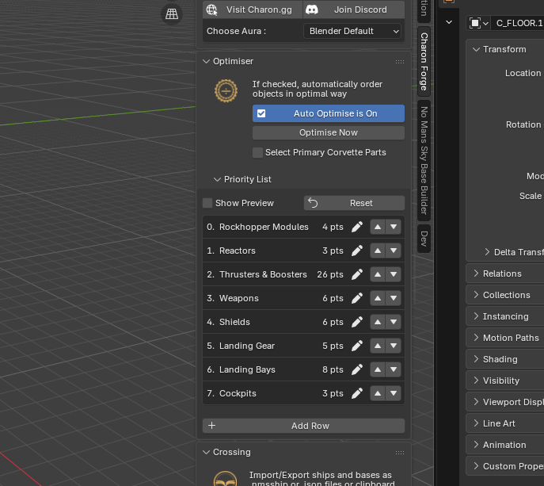

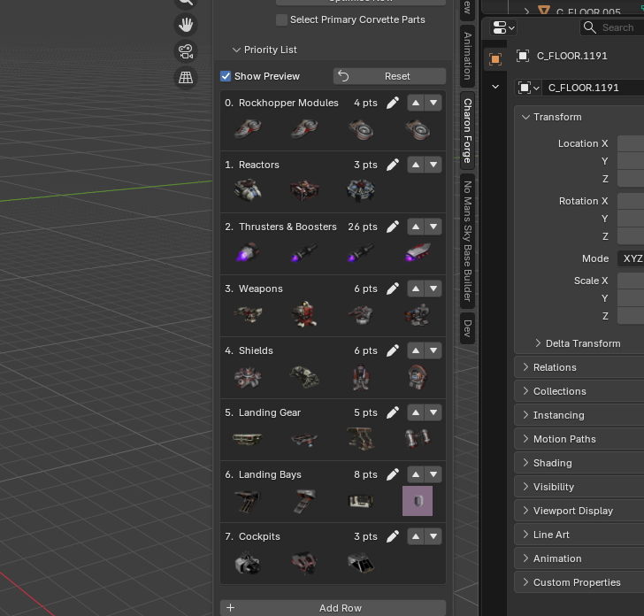

- **Select Primary Corvette Parts:** a ship can have several cockpits and landing bays. The primary ones are saved ahead of the others of their kind, so the game takes them as the ship's own.
  - Charon picks them for you: on import, the first cockpit and landing bay in the file, and when placing parts, the first of each placed.
  - You can change the picks here at any time.

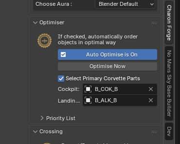

### Crossing: import and export

Moving ships and bases in and out of Blender.

- **File:**
  - **Import File** reads `.nmsship` corvette files and `.json` / `.txt` part lists.
  - **Export File** writes a `.nmsship` corvette, with its name, ship record and customisation, or a `.json` part list.
- **Clipboard:**
  - **Import** reads a part list (or a whole base) from the clipboard.
  - **Export** copies the scene to it.
  - **Objects Only** copies just the parts; untick it to copy the whole base with its name, address and other properties.
- **Imports replace the scene.** Importing clears the previous build first. Lights, cameras and space stations stay. `Ctrl+Z` brings the old build back.
- Groups and Forge shapes export as the individual parts they're made of, so the game sees a normal build.

### The Watchtower

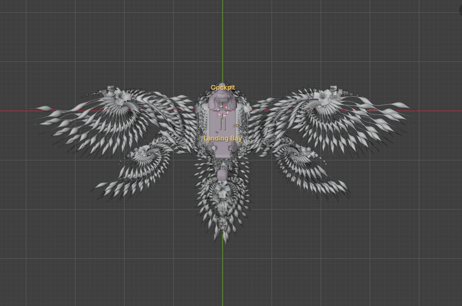

An overlay in the corner of the 3D viewport:
- **The base:** its name, its type (Planet Base, Corvette, Freighter, Space Base, Space Station Base, and so on) and its **part count**. The count includes the parts inside groups and Forge shapes, so it's the number the game will see.
- **The selected part:** its id, name, colour and material.
- **Overlay Options** chooses what's shown and in which corner, and the eye button shows or hides it all.
- **Label Primary Parts** floats a "Cockpit" and "Landing Bay" label over the ship's primary cockpit and landing bay.

### The Forge

Build large shapes out of copies of a single part, and more.

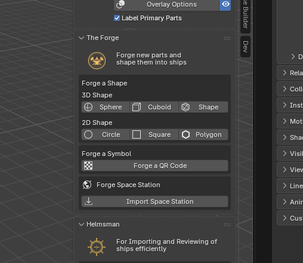

**Forge a Shape.** Select any part, then choose a shape:
- **3D shapes:** **Sphere**, **Cuboid**, and **Shape** (other solids).
- **2D shapes:** **Circle**, **Square**, and **Polygon**.

The shape is made of copies of your part and stays adjustable: change its size, how many copies it has, how they're laid out, and how big each one is. The viewport updates as you go, even with thousands of copies. **Split into Parts** turns it into ordinary parts when you're done. Shapes keep the part's colour, count towards the part total, and export as their individual parts.

**Forge a Symbol:**
- **Forge a QR Code:** type any text or a link, and Charon builds a scannable QR code out of storage panels at the 3D cursor.
  - It uses as few panels as it can: long runs and blocks are covered by single, larger panels.
  - The popup shows the code's size and roughly how many panels it will take before you build it.

**Forge Space Station.** Build a full space station from the game's own station models, to design a base inside it:
- **Design:** choose the interior and exterior, the ring, top and under modules, and the hull and interior colours. Or enter a **Galactic Address** to get the exact station of that star system.
- Importing a base that sits inside a space station offers to build its station for you.
- Show or hide the core, runway, their roofs and the exterior. **Frame** either one in the view. Make the station selectable or not, modify it, or remove it.

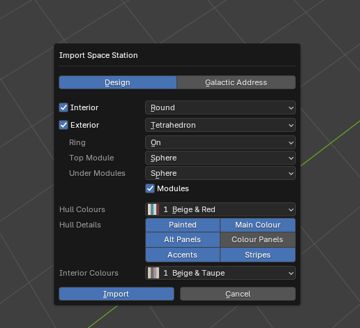

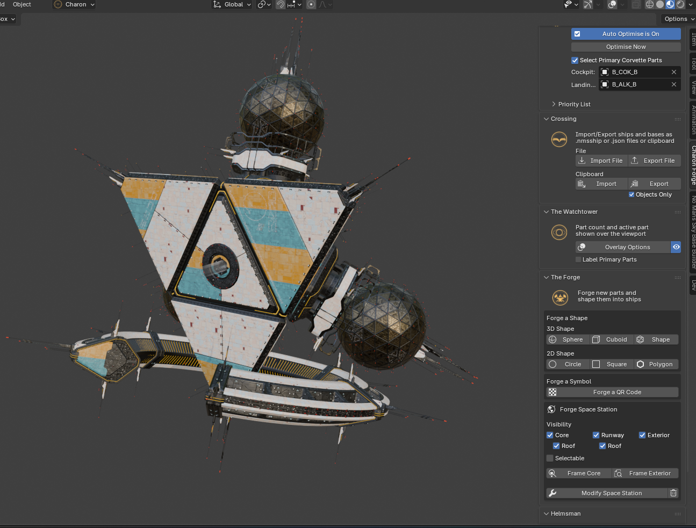

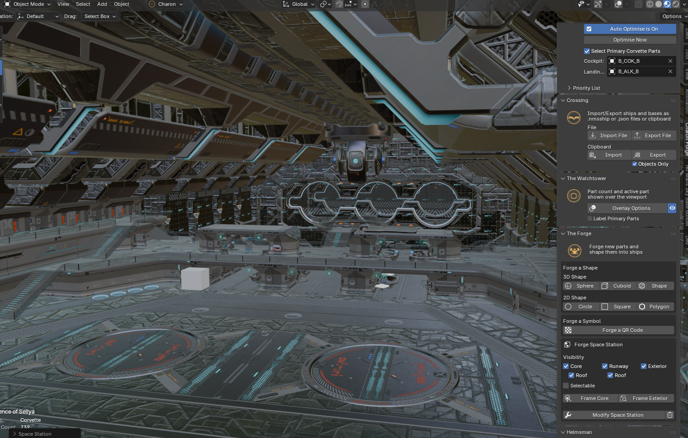

### Helmsman

For reviewing a batch of ships and writing the chosen ones into a save, for example a community build contest. It works in four steps:
1. **Account / Save Slot:** pick the No Man's Sky account and save slot to work with.
2. **Select Files for Review:** load a batch of ships from a file or the clipboard.
3. **Load into Ship Slots:**
   - Go through the ships page by page. Import any ship into the scene to look at it, and add a note to it.
   - Approve or reject it, and choose which of the save's corvette slots it goes into.
   - **Export to Save** writes every assigned ship into the save in one go, with a backup made first.
4. **Export Results:** copy the review results to the clipboard, or save them as files.

---

## Working with the No Man's Sky Base Builder addon

Charon Forge works on its own. The asset browser, importing and exporting, the Forge and the rest all work without any other addon.

With the **No Man's Sky Base Builder** addon also installed, Charon Forge connects to it automatically:
- The Base Builder's own tools (snapping, mirroring, grouping, its colour panel) place and colour Charon's high-resolution parts.
- Mirroring fixes the parts whose mirrored form in the game isn't a simple mirror image, so they come out facing the right way in game.
- Fossils, groups and colours behave the same with either set of tools.
- **Simple Proxies** and **Replace Selected Objects** use the Base Builder's models and tools, so they need it installed. Charon says so where that applies.

---

## Credits and support

Created and maintained by **kume_the_wizard**.

- Website: [charon.gg](https://charon.gg/)
- Discord: [Join the Charon Discord](https://discord.gg/gW2AvwTwym)

No Man's Sky is a trademark of Hello Games. Charon Forge is a fan-made tool and is not affiliated with or endorsed by Hello Games.
